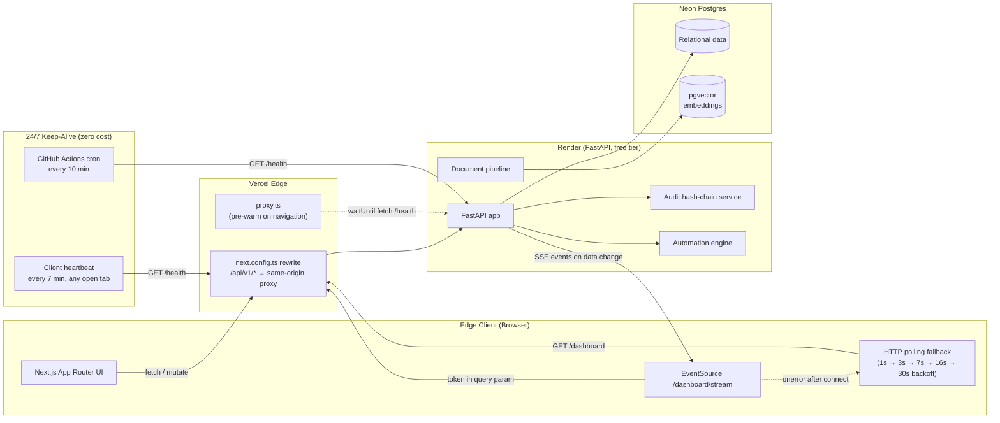

<div align="center">

# AI Project Command Center

**Enterprise project-management + decision-intelligence platform — real CPM scheduling, real workload optimization, real tamper-evident governance. No mocked data, no fake AI theater.**

[](https://nextjs.org/)
[](https://www.typescriptlang.org/)
[](https://fastapi.tiangolo.com/)
[](https://neon.tech/)
[](https://vercel.com/)
[](https://render.com/)

<br/>

### 🔎 [**Live Public Preview — Governance & Compliance Console**](https://ai-project-mgmt-system.vercel.app/app/governance)

*Public Evaluation Mode: zero sign-up, full audit trail, live SHA-256 hash-chain — `actor_email`/`ip_address` redacted server-side for anonymous visitors, everything else real and unredacted.*

**[ai-project-mgmt-system.vercel.app](https://ai-project-mgmt-system.vercel.app)**

</div>

---

## What this actually is

A single-tenant demo instance running real portfolio data — 15 projects, $452.5M in tracked capital deployment, 47 live risks — computed by deterministic services, not hardcoded numbers. Where the platform uses AI (meeting-transcript extraction, executive briefs, RAG document Q&A), every response is schema-validated and labeled with its real source. Where it doesn't need AI — health scoring, cost forecasting, critical-path scheduling, resource balancing — it's plain, auditable, explainable logic, on purpose: **AI is never the single point of failure for a number a PM has to act on.**

Runs at zero hosting cost: Vercel Hobby + Render free tier + Neon serverless Postgres, kept awake around the clock by a self-hosted GitHub Actions cron — no paid uptime service.

---

## The six pillars

<details>
<summary><strong>🗓️ Critical Path Scheduling Engine</strong> — dependency-aware CPM, bottleneck detection, Monte Carlo forecasting</summary>

<br/>

Real critical-path-method scheduling over the task dependency graph, not a static Gantt skin. `bottleneck_detection.py` walks the graph to surface the tasks actually constraining a project's finish date; `monte_carlo.py` runs probabilistic completion-date forecasting instead of a single point estimate. Delay-impact and slack are computed, not eyeballed.

</details>

<details>
<summary><strong>⚖️ Workload Balancer</strong> — rule-based resource optimization, explainable candidate ranking</summary>

<br/>

Skill-match, availability, and cost-based candidate ranking for task assignment (`workload_balancer.py`) plus one-click "Auto-Balance Portfolio Workload" suggestions on the Resources page. Explainable by design — every suggestion states *why*, no black-box scoring.

</details>

<details>
<summary><strong>🎙️ Meeting Intelligence</strong> — transcript → real decisions, action items, and risks</summary>

<br/>

Paste a raw meeting transcript; the AI layer extracts structured action items, decisions, and risks, schema-validated before they ever reach the UI. Approved action items commit straight into a project's real work breakdown structure — no manual re-typing step.

</details>

<details>
<summary><strong>⚡ Event-Driven Automations</strong> — real triggers evaluated against real current data</summary>

<br/>

Rule-based automation engine (`automation_engine.py`): e.g. *Critical Path Task Overdue → Auto-Create Schedule Risk*. No background scheduler on the free tier — rules evaluate lazily on real traffic (notification polling) or immediately via manual Test Trigger, with a real execution log, not a simulated one.

</details>

<details>
<summary><strong>🔒 SHA-256 Governance & Tamper-Evident Audit Trail</strong> — hash-chained, independently re-verifiable</summary>

<br/>

Every audited action is hash-chained at write time: `record_hash = SHA256(prev_hash + org_id + action + entity_type + entity_id + metadata)`. Chain continuity is independently re-verifiable both server-side and by recomputing the hash client-side. The public Governance console exposes this live, with `actor_email`/`ip_address` redacted server-side (not just hidden in the UI) for any non-admin caller — see [`backend/app/api/audit.py`](backend/app/api/audit.py).

</details>

<details>
<summary><strong>🌐 Tri-lingual RTL Engine</strong> — English, Arabic (RTL), Turkish — one design system</summary>

<br/>

Full English / Arabic / Turkish translation across nav, terminology, and command surfaces, with genuine logical-CSS RTL support (`start`/`end`, not hardcoded `left`/`right`) rather than a mirrored stylesheet bolted on after the fact. Toggles `dir`/`lang` on `<html>` at runtime.

</details>

---

## Live architecture



**Resilience, not just uptime:** the SSE dashboard stream falls back to backoff-polling if it never connects *or* if a live connection drops mid-session; the connection-status indicator suppresses transient reconnects for 45 seconds before surfacing an honest warning, so a routine free-tier cold start never reads as an outage.

---

## Stack

| Layer | Technology |
|---|---|
| Frontend | Next.js 16 (App Router, Turbopack) · React 19 · TypeScript · Tailwind CSS v4 |
| Backend | FastAPI · SQLAlchemy 2.0 · Alembic · Pydantic v2 |
| Database | PostgreSQL (Neon serverless) · pgvector for document embeddings |
| Auth | JWT (bcrypt-hashed passwords), anonymous read-only demo sessions |
| AI layer | Dual-provider routing with failover, response caching, rate limiting |
| Hosting | Vercel (frontend) · Render (backend) — both free tier |
| CI/keep-alive | GitHub Actions |

## Local development

```bash
# Backend
cd backend
python -m venv .venv && .venv/Scripts/activate  # or source .venv/bin/activate
pip install -r requirements.txt
alembic upgrade head
uvicorn app.main:app --reload

# Frontend
cd frontend
npm install
npm run dev
```

See [`docs/`](docs) for architecture notes, deployment handover, and the full phase-by-phase project plan.
