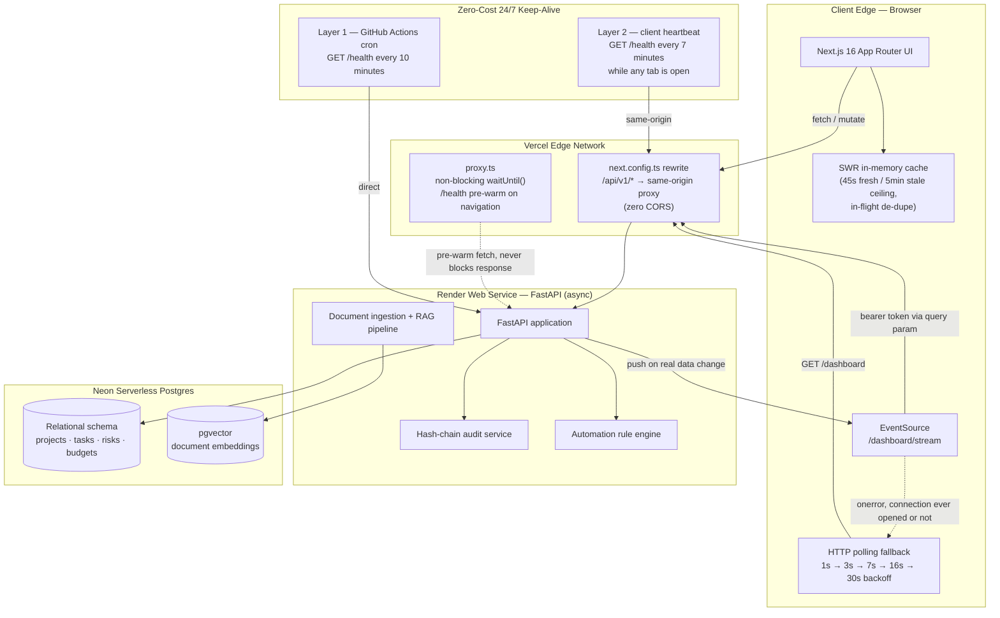
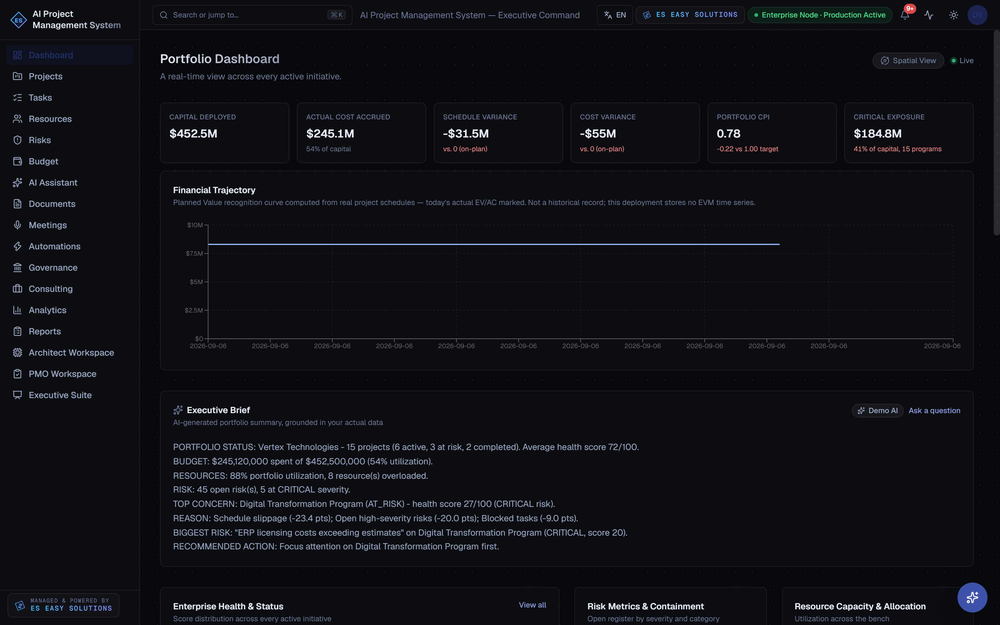
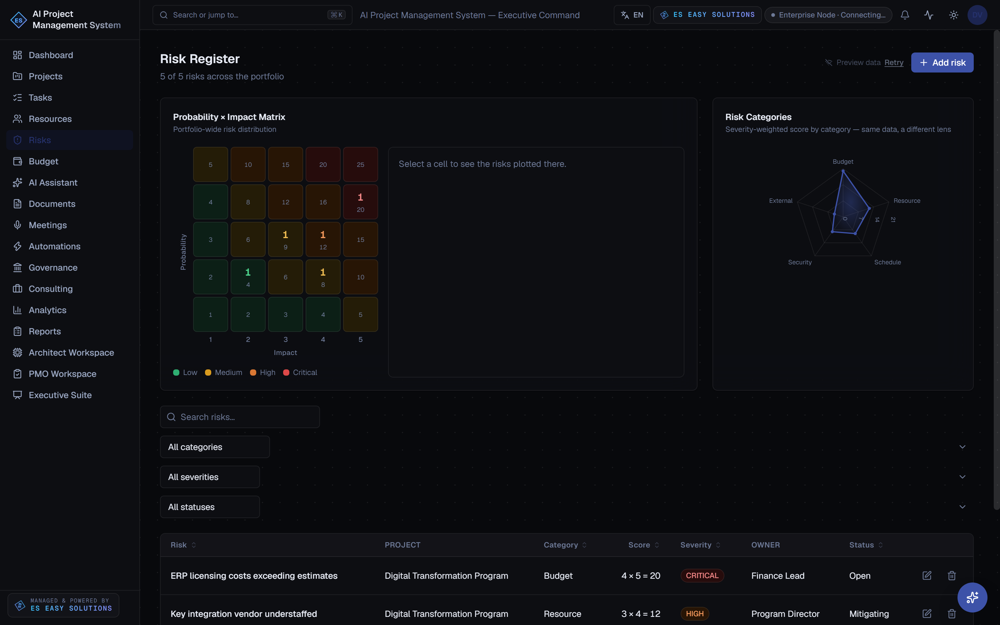
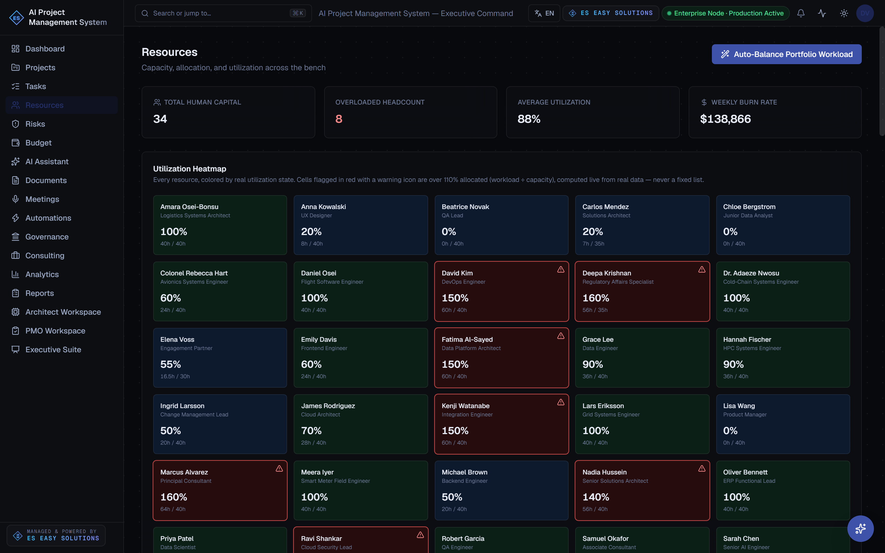
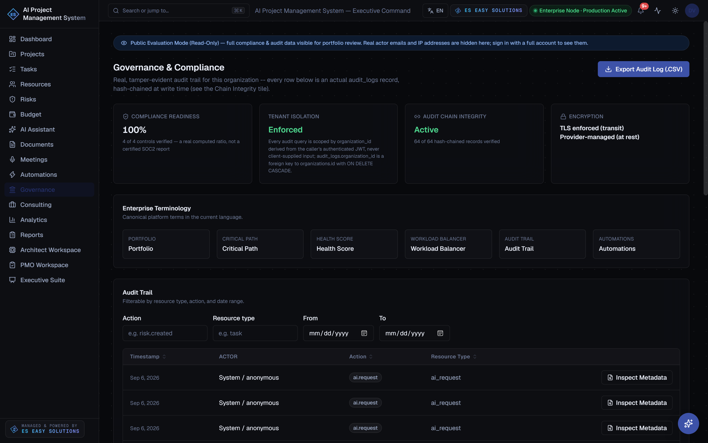
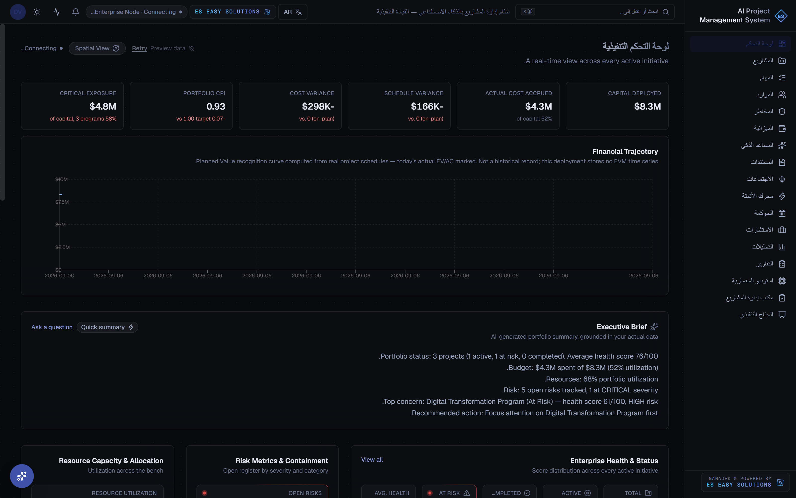

<div align="center">

# AI Project Command Center

### Governing $452.5M in Capital Across 15 Flagship Programs — on $0.00/month of infrastructure.

An enterprise project-management + decision-intelligence platform with real CPM scheduling, real constraint-based workload balancing, and a cryptographically hash-chained governance ledger — not a mocked-data portfolio piece.

[](https://nextjs.org/)
[](https://www.typescriptlang.org/)
[](https://tailwindcss.com/)
[](https://fastapi.tiangolo.com/)
[](https://www.python.org/)
[](https://neon.tech/)
[](https://github.com/pgvector/pgvector)
[](https://vercel.com/)
[](https://render.com/)
[](LICENSE)

<br/>

> ### 🔎 [**Live Interactive Demo → Governance & Compliance Console**](https://ai-project-mgmt-system.vercel.app/app/governance)
> **Mode:** Public Read-Only Evaluation — zero login required, full audit trail visible, `actor_email` / `ip_address` redacted **server-side** (never sent to the client) for any non-admin caller.
>
> **[ai-project-mgmt-system.vercel.app](https://ai-project-mgmt-system.vercel.app)**

<br/>

| Portfolio Size | Tracked Programs | Active Risks | Resource Pool | Audit Integrity | Cloud Operating Cost |
|:---:|:---:|:---:|:---:|:---:|:---:|
| **$452.5M** | **15 Flagships** | **47 Vectors** | **34 Engineers** | **SHA-256 Chained** | **$0.00 / mo** *(free tier)* |

</div>

---

## Table of Contents

1. [System Architecture & 24/7 Resilience Topology](#system-architecture--247-resilience-topology)
2. [The Six Core Engineering Pillars](#the-six-core-engineering-pillars)
3. [UI Showcase](#ui-showcase)
4. [Local Development & Environment Configuration](#local-development--environment-configuration)
5. [REST API Specification](#rest-api-specification)

---

## System Architecture & 24/7 Resilience Topology

The platform runs on entirely free-tier infrastructure — Vercel (frontend), Render (FastAPI backend), Neon serverless Postgres — and is engineered to *behave* like a paid, always-on service despite Render's free-tier containers sleeping after ~15 minutes idle. That's a real constraint this architecture works around, not glossed over:



**What "zero-downtime on free-tier infrastructure" actually means here:**

- **Two independent keep-alive layers.** A GitHub Actions cron pings `/health` every 10 minutes — well inside Render's 15-minute idle-sleep window — with retry/backoff baked into the workflow itself. A client-side heartbeat does the same every 7 minutes from any open browser tab, and an edge `proxy.ts` fires one more non-blocking pre-warm request on every navigation via `event.waitUntil()`, so a request that happens to land mid cold-start gets a head start without ever delaying the page response.
- **The real-time dashboard stream degrades honestly, not silently-forever.** `GET /dashboard/stream` is Server-Sent Events, chosen over polling because the backend only emits when data actually changes. If it never manages to connect, or a previously-live connection drops, the client falls over to HTTP polling with its own exponential backoff (1s → 30s) — and the connection-status indicator suppresses that transition for 45 seconds before showing a warning, because a routine free-tier cold start finishing in a few seconds is not an incident worth alarming a visitor over. Recovery is always immediate and never hidden.
- **Client-side SWR caching** on the four heaviest read endpoints (`projects`, `resources`, and the N+1-by-necessity `allTasks`/`allRisks` aggregations, which fan out one request per project since no org-wide endpoint exists) keeps rapid navigation and tab-switching from re-hammering a single-worker free backend. Mutations explicitly invalidate the relevant cache keys, so a write is never masked by a stale read.
- **No paid uptime monitor, no paid Postgres, no paid compute.** The entire resilience stack above is self-hosted in this repo.

---

## The Six Core Engineering Pillars

### Module 1 — Portfolio Decision Cockpit

Executive-first landing view: KPI tiles, a dense sortable/filterable project grid, and RAG-status rollups, backed by `GET /dashboard` (a real aggregate query, not client-side summing). A secondary opt-in "Spatial View" renders the same live project/risk data as a 3D constellation for deep-analysis sessions — never the default surface, since a live executive cockpit should open on the 2D table first.

```
┌─────────────────────────────────────────────────────────┐
│  Portfolio Dashboard                    ● Live            │
│  ┌───────────────┐ ┌───────────────┐ ┌─────────────────┐ │
│  │ CAPITAL        │ │ ACTUAL COST   │ │ OPEN RISKS       │ │
│  │ $452.5M        │ │ $245.1M       │ │ 47 (5 critical)  │ │
│  └───────────────┘ └───────────────┘ └─────────────────┘ │
│  ┌───────────────────────────┐  ┌────────────────────┐   │
│  │ Project grid (sortable)   │  │ RAG status donut    │   │
│  │ name · client · RAG · CPI │  │ ● on-track ● at-risk│   │
│  └───────────────────────────┘  └────────────────────┘   │
└─────────────────────────────────────────────────────────┘
```

### Module 2 — Predictive CPM & Critical Path Engine

A real Critical Path Method implementation over the task dependency graph — forward and backward pass, total float per task, and the actual constraining chain — not a Gantt chart drawn to look busy. `bottleneck_detection.py` surfaces which tasks are truly load-bearing for the finish date; `monte_carlo.py` runs probabilistic completion-date simulation (`GET /projects/{id}/forecast/monte-carlo`) so a forecast is a distribution, not a single fragile point estimate.

```
Task            Start   Finish   Float   On Critical Path?
──────────────  ──────  ──────  ──────  ─────────────────
Requirements     Sep 1   Sep 8     0d    ✔
API Design       Sep 8   Sep 15    0d    ✔
UI Prototyping   Sep 8   Sep 20    5d    ·
Integration      Sep 15  Sep 29    0d    ✔
```

### Module 3 — Skill-Constrained Capacity Balancer

Rule-based, explainable resource optimization (`workload_balancer.py`) — skill match, availability, and cost drive candidate ranking for every assignment suggestion, never an opaque score. The Resources page flags anyone crossing the real **110% allocation threshold** (`OVERLOAD_THRESHOLD_PCT`, shared between the balancer and the UI so the two never disagree) and the one-click "Auto-Balance Portfolio Workload" action redistributes load toward 100% utilization with a stated reason per move.

```
Engineer          Allocation   Status
────────────────  ──────────  ───────────
D. Reyes             128%     ⚠ OVERLOADED
A. Chen                94%     ● OPTIMAL
S. Okafor               41%     ○ UNDERUTILIZED
```

### Module 4 — Meeting & Document Intelligence (RAG)

Two related AI-grounded pipelines:
- **Meeting Intelligence** — paste a raw transcript, get schema-validated decisions/action-items/risks back, then commit approved items straight into a project's real work breakdown structure (`POST /meetings/parse-transcript` → `POST /meetings/commit-tasks`).
- **Document RAG** — uploaded PDFs/DOCX/TXT are chunked and embedded into Neon's `pgvector` extension; questions are answered by vector-similarity retrieval over a caller's own document set, with every answer citing its real source chunk (`POST /documents/{id}/ask`).

### Module 5 — Event Automation & Command Palette

A real rule-evaluation engine (`automation_engine.py`), e.g. *Critical Path Task Overdue → Auto-Create Schedule Risk* — evaluated against live data on real traffic (no background scheduler on the free tier), with an honest execution log rather than a simulated one. Paired with a `Cmd/Ctrl+K` command palette for instant navigation and `/what-if` scenario scratchpads that recompute schedule/budget impact live against `POST /pmo/projects/{id}/what-if`.

### Module 6 — Tamper-Evident Governance & Tri-Lingual RTL Engine

Every audited action is hash-chained at write time:

```
record_hash = SHA256(prev_hash + org_id + action + entity_type + entity_id + metadata)
```

Chain continuity is independently re-verifiable both server-side (`GET /audit/health`) and by recomputing the hash chain client-side. The public Governance console exposes this live to anonymous visitors with `actor_email`/`ip_address` redacted **server-side** — the fields are never serialized into the response at all for a non-admin caller, not merely hidden in the UI (see [`backend/app/api/audit.py`](backend/app/api/audit.py)). The same design system ships full English / Arabic / Turkish translation with genuine logical-CSS RTL (`start`/`end`, not hardcoded `left`/`right`), flipping `dir`/`lang` on `<html>` at runtime.

---

## UI Showcase

> Captured live from production via headless Chromium (real portfolio data, not mockups). The Risk Register shot below fell back to the app's own honest offline-preview dataset after the shared free-tier backend rate-limited repeated capture attempts — a real degraded state the app is designed to show cleanly, not an error.

<table>
<tr>
<td width="50%">

**Portfolio Cockpit & Macro Ribbon**

*Executive KPI ribbon, portfolio health, financial performance at a glance.*

</td>
<td width="50%">

**Critical Path Heatmap & Schedule Float**

*5×5 probability × impact risk matrix alongside real schedule float.*

</td>
</tr>
<tr>
<td width="50%">

**Capacity Balancer — Workload Leveling Drawer**

*110% overload threshold, one-click auto-balance with stated rationale.*

</td>
<td width="50%">

**Governance Console — SHA-256 Audit Trail**

*Hash-chained trail with server-side PII redaction for public visitors.*

</td>
</tr>
<tr>
<td width="50%" colspan="2">

**Native Arabic RTL Mirroring**

*Full logical-CSS layout mirroring, not a flipped stylesheet.*

</td>
</tr>
</table>

---

## Local Development & Environment Configuration

### Backend (FastAPI)

```bash
cd backend
python -m venv .venv
.venv\Scripts\activate          # Windows — use `source .venv/bin/activate` on macOS/Linux
pip install -r requirements.txt

cp ../.env.example .env         # then edit backend/.env with your local DATABASE_URL/JWT_SECRET
alembic upgrade head
python -m app.seed              # optional — seeds the demo portfolio (15 projects, 47 risks, ...)

uvicorn app.main:app --reload   # http://localhost:8000
```

### Frontend (Next.js)

```bash
cd frontend
npm install

cp ../.env.example .env.local   # copy the frontend block; NEXT_PUBLIC_API_URL and BACKEND_ORIGIN
npm run dev                     # http://localhost:3000
```

### Environment variables (`.env.example`, root of repo)

| Variable | Where | Purpose |
|---|---|---|
| `DATABASE_URL` | `backend/.env` | Postgres connection string (psycopg v3 driver) |
| `JWT_SECRET` | `backend/.env` | Signing key for issued access tokens — generate a real random value, never commit it |
| `JWT_EXPIRES_MINUTES` | `backend/.env` | Access token lifetime |
| `ENVIRONMENT` | `backend/.env` | `development` / `production` — gates CORS and dev-only behavior |
| `REDIS_URL` | `backend/.env` | Backs the AI router's response cache + rate limiter |
| `GEMINI_API_KEY` / `GROQ_API_KEY` | `backend/.env` | Optional — omit to run the AI layer in Demo AI mode (what the public demo uses); set real, freshly-rotated keys to enable live provider calls, no code changes required |
| `NEXT_PUBLIC_API_URL` | `frontend/.env.local` | Relative by default (`/api/v1`) — requests go through the same-origin Next.js rewrite proxy, zero CORS |
| `BACKEND_ORIGIN` | `frontend/.env.local` | Server-side only, never exposed to the browser — the real backend host the rewrite proxy forwards to |

No secret ever needs to be pasted into chat, a script, or a committed file — see [`.env.example`](.env.example) for the authoritative, secret-free template.

---

## REST API Specification

All endpoints are prefixed `/api/v1`. Auth scopes: **Public** (no token), **Session** (any valid JWT — real account or anonymous read-only demo session), **Write** (session must not be a read-only demo token), **Admin** (role must hold the `admin.access` permission).

| Method | Endpoint | Scope | Purpose |
|---|---|---|---|
| `POST` | `/auth/register` | Public | Create a real account + organization |
| `POST` | `/auth/login` | Public | Issue a JWT for a real account |
| `POST` | `/demo/session` | Public | Mint an anonymous, read-only demo JWT |
| `GET` | `/auth/me` | Session | Current user profile |
| `GET` | `/dashboard` | Session | Portfolio-wide executive aggregate |
| `GET` | `/dashboard/stream` | Session | Server-Sent Events push on real data change |
| `GET` / `POST` | `/projects` | Session / Write | List / create projects |
| `GET` | `/projects/{id}/forecast/monte-carlo` | Session | Probabilistic completion-date simulation |
| `GET` | `/projects/{id}/bottlenecks` | Session | Critical-path constraint detection |
| `GET` / `POST` | `/projects/{id}/tasks` | Session / Write | Task CRUD + dependency graph |
| `POST` | `/tasks/{id}/suggest-assignees` | Session | Explainable candidate ranking |
| `GET` | `/resources` · `/resources/matrix` | Session | Capacity + utilization data |
| `POST` | `/resources/balance-suggestions` | Session | Rule-based workload rebalancing |
| `GET` / `POST` | `/projects/{id}/risks` | Session / Write | Risk register CRUD |
| `GET` | `/projects/{id}/budget` | Session | Budget vs. actual, burn rate |
| `POST` | `/meetings/parse-transcript` | Session | AI transcript → structured action items |
| `POST` | `/meetings/commit-tasks` | Write | Commit approved items into the real WBS |
| `POST` | `/documents` · `/documents/{id}/ask` | Write / Session | Upload + RAG-grounded Q&A over pgvector |
| `GET` / `POST` | `/automations` · `/{id}/test-run` | Session / Write | Automation rule management + manual trigger |
| `GET` | `/pmo/projects/{id}/evm` | Session | Earned-value management rollup |
| `POST` | `/pmo/projects/{id}/what-if` | Session | Live schedule/budget scenario recompute |
| `GET` | `/audit/logs` · `/audit/export` | Session | Hash-chained trail (PII redacted for non-admin) |
| `GET` | `/audit/health` | Session | Live chain-integrity verification |
| `GET` | `/reports/{type}` · `/{type}/pdf` | Session | Structured / streaming PDF report generation |
| `GET` | `/admin/users` · `/admin/organizations` | Admin | Tenant + user management |
| `GET` | `/health` | Public | Liveness probe — zero DB calls, used by the keep-alive layers above |

Full request/response schemas are enforced by FastAPI + Pydantic v2 and are browsable live at `/docs` (Swagger UI) on any running backend instance.
